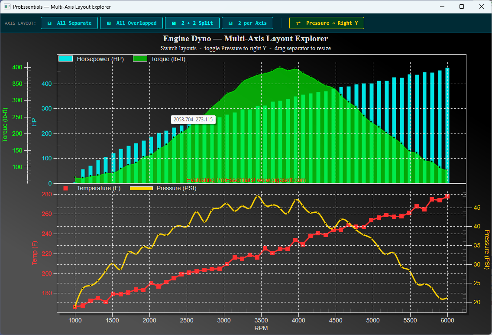

# ProEssentials WPF — Multi-Axis Layout Explorer

A ProEssentials v10 WPF .NET 8 demonstration of four distinct multi-axis
layout configurations — switchable live with toolbar buttons — in a single
`PesgoWpf` chart. A toggle button moves one series to the right Y axis in
any layout, showing how `RYAxisComparisonSubsets` is `WorkingAxis`-dependent.



➡️ [gigasoft.com/examples](https://gigasoft.com/examples)

---

## What This Demonstrates

Engine dyno data — Horsepower, Torque, Temperature, and Pressure vs RPM —
rendered with four completely different axis arrangements at the click of a
button. All configuration changes happen in ~10 property assignments; the
chart re-renders atomically via `ReinitializeResetImage()`.

| Button | Layout | Pattern | Key Properties |
|--------|--------|---------|----------------|
| **All Separate** | 4 independent stacked axes | Examples 012 | `MultiAxesSubsets[0..3]=1`, no overlap |
| **All Overlapped** | All 4 share one Y region, 4 scales | Example 103 | `OverlapMultiAxes[0]=4` |
| **2 + 2 Split** | HP+Torque top, Temp+Pressure bottom | Example 104 | `OverlapMultiAxes[0]=2,[1]=2` |
| **2 per Axis** | Two sections, two series each | Example 013 | `MultiAxesSubsets[0]=2,[1]=2` |
| **Pressure → Right Y** | Moves Pressure to right Y in any layout | Example 007 | `RYAxisComparisonSubsets` per `WorkingAxis` |

---

## ProEssentials Features Demonstrated

### Multi-Axis Architecture

`MultiAxesSubsets` defines how many subsets each axis group owns.
`OverlapMultiAxes` groups axis groups into shared visual regions.
`MultiAxesProportions` controls the height split between visual regions.

```csharp
// All Separate — 4 stacked sections
Pesgo1.PeGrid.MultiAxesSubsets[0] = 1;
Pesgo1.PeGrid.MultiAxesSubsets[1] = 1;
Pesgo1.PeGrid.MultiAxesSubsets[2] = 1;
Pesgo1.PeGrid.MultiAxesSubsets[3] = 1;
Pesgo1.PeGrid.MultiAxesProportions[0] = 0.25f;  // ... [1..3] = 0.25f

// All Overlapped — one region, four independent scales
Pesgo1.PeGrid.OverlapMultiAxes[0] = 4;
Pesgo1.PeGrid.MultiAxesProportions[0] = 1.0f;

// 2 + 2 Split — two stacked overlapped groups
Pesgo1.PeGrid.OverlapMultiAxes[0] = 2;  // axes 0+1 share top
Pesgo1.PeGrid.OverlapMultiAxes[1] = 2;  // axes 2+3 share bottom
Pesgo1.PeGrid.MultiAxesProportions[0] = 0.5f;
Pesgo1.PeGrid.MultiAxesProportions[1] = 0.5f;

// 2 per Axis — two sections, two subsets each
Pesgo1.PeGrid.MultiAxesSubsets[0] = 2;
Pesgo1.PeGrid.MultiAxesSubsets[1] = 2;
```

**Critical — always clear arrays before reconfiguring:**

```csharp
for (int i = 0; i < 4; i++)
{
    Pesgo1.PeGrid.MultiAxesSubsets[i]     = 0;
    Pesgo1.PeGrid.OverlapMultiAxes[i]     = 0;
    Pesgo1.PeGrid.MultiAxesProportions[i] = 0f;
}
```

---

### WorkingAxis — Per-Axis Configuration

`WorkingAxis` selects which axis subsequent property assignments target.
Color, label, plotting method, and right Y configuration are all per-axis:

```csharp
Pesgo1.PeGrid.WorkingAxis = 0;
Pesgo1.PeColor.YAxis       = ColorHP;       // axis label color
Pesgo1.PeString.YAxisLabel = "HP";
Pesgo1.PePlot.Method       = SGraphPlottingMethod.Bar;

Pesgo1.PeGrid.WorkingAxis = 1;
Pesgo1.PeColor.YAxis       = ColorTorque;
Pesgo1.PeString.YAxisLabel = "Torque (lb-ft)";
Pesgo1.PePlot.Method       = SGraphPlottingMethod.SplineArea;

// ... axes 2 and 3 ...

// Always reset when done
Pesgo1.PeGrid.WorkingAxis = 0;
```

In overlapped mode the axis color sync is essential — it lets the user
associate each independent Y scale with its corresponding data line.

---

### RYAxisComparisonSubsets — WorkingAxis-Dependent Right Y

`RYAxisComparisonSubsets` is a `WorkingAxis`-dependent property. Setting it
on a given axis moves the last N subsets of **that axis** to the right Y:

```csharp
// Layouts 0, 1, 2: Pressure is on axis 3
Pesgo1.PeGrid.WorkingAxis = 3;
Pesgo1.PePlot.RYAxisComparisonSubsets = _ryActive ? 1 : 0;
Pesgo1.PeColor.RYAxis     = ColorPSI;
Pesgo1.PeString.RYAxisLabel = "Pressure (PSI)";

// Layout 3 (2 per Axis): Pressure is the last subset of axis 1
Pesgo1.PeGrid.WorkingAxis = 1;
Pesgo1.PePlot.RYAxisComparisonSubsets = _ryActive ? 1 : 0;
```

The toggle re-applies the current layout so the axis configuration
rebuilds cleanly from scratch each time.

---

### Mixed Plotting Methods (Example 022 pattern)

Each axis gets a different `SGraphPlottingMethod`, giving each series
a distinct visual identity that survives across all layout modes:

| Series | Method |
|--------|--------|
| Horsepower | `Bar` |
| Torque | `SplineArea` |
| Temperature | `PointsPlusLine` |
| Pressure | `Spline` |

---

### DuplicateDataX — Efficient X Storage

All 4 subsets share the same RPM sweep. `DuplicateDataX = PointIncrement`
stores only one row of X values instead of 4 × 50 = 200 identical values:

```csharp
Pesgo1.PeData.DuplicateDataX = DuplicateData.PointIncrement;
// Only set X[0, p] — the chart duplicates it for subsets 1, 2, 3
for (int p = 0; p < Points; p++)
    Pesgo1.PeData.X[0, p] = 1000f + p * (5000f / (Points - 1));
```

---

## Controls

| Input | Action |
|-------|--------|
| **All Separate / Overlapped / 2+2 Split / 2 per Axis** | Switch axis layout instantly |
| **Pressure → Right Y** | Toggle Pressure to right Y axis (gold = active) |
| Drag separator | Resize axis sections (where `MultiAxesSizing = true`) |
| Left-click drag | Zoom box |
| Right-click | Context menu — export, print, customize |

---

## Prerequisites

- Visual Studio 2022
- .NET 8 SDK

---

## How to Run

```
1. Clone this repository
2. Open MultiAxisLayoutExplorer.sln in Visual Studio 2022
3. Build → Rebuild Solution (NuGet restore is automatic)
4. Press F5
```

---

## NuGet Package

References
[`ProEssentials.Chart.Net80.x64.Wpf`](https://www.nuget.org/packages/ProEssentials.Chart.Net80.x64.Wpf).
Package restore is automatic on build.

---

## Related Examples

- [WPF Mouse Interaction Hotspots](https://github.com/GigasoftInc/wpf-chart-mouse-interaction-hotspots-coordinate-tracking-proessentials)
- [WPF Custom Y-Axis Labeling](https://github.com/GigasoftInc/wpf-chart-custom-yaxis-labels-annotations-events-proessentials)
- [All Examples — GigasoftInc on GitHub](https://github.com/GigasoftInc)
- [Full Evaluation Download](https://gigasoft.com/net-chart-component-wpf-winforms-download)
- [gigasoft.com](https://gigasoft.com)

---

## License

Example code is MIT licensed. ProEssentials requires a commercial
license for continued use.
